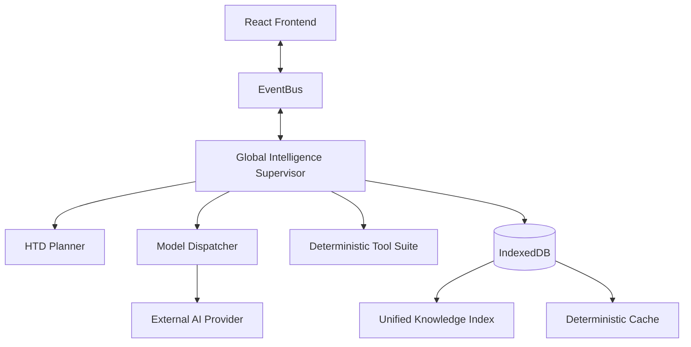

# System Architecture

Kyoki follows a **Local-First, Intelligence-Driven** architecture.

## 1. High-Level Topology

## 2. Intelligence Layer v3.0

The core of Kyoki is the **8-Agent Engineering Pipeline**:

1.  **Product Architect**: User Intent -> PRD.json
2.  **UX Architect**: PRD -> DesignSystem.md
3.  **Frontend Engineer**: Design -> FrontendArch.md
4.  **Backend Architect**: FrontendArch -> OpenAPI.yaml
5.  **Data Modeler**: OpenAPI -> Schema.sql
6.  **Security Engineer**: Architecture -> ThreatModel.md
7.  **Platform Engineer**: Architecture -> Infra.tf
8.  **SDET**: Artifacts -> TestPlan.md

## 3. Data Flow & Security

1.  **Input**: User types prompt.
2.  **Seeding**: `deterministic.ts` generates a SHA-256 seed from the Project ID.
3.  **Planning**: `planner.ts` creates a DAG of tasks.
4.  **Execution**: `dispatcher.ts` calls LLM.
    *   *Check*: Is the prompt hash in `det_cache`? If yes, return cached.
    *   *Call*: If no, call API (redacting PII).
5.  **Validation**: `tools.ts` runs scanners (Security, Mermaid) on output.
6.  **Persistence**: Result stored in `IndexedDB (blueprints store)`.

## 4. Storage Schema

- **projects**: Metadata & Settings.
- **blueprints**: Versioned content & artifacts.
- **jobs**: Intelligence Layer execution logs.
- **det_cache**: { hash_key: encrypted_response }.
- **uki_chunks**: Vector embeddings for RAG.
